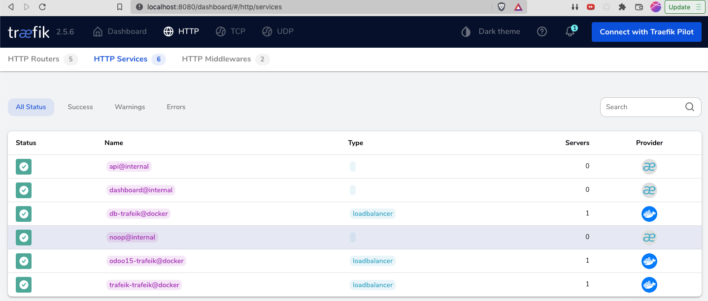
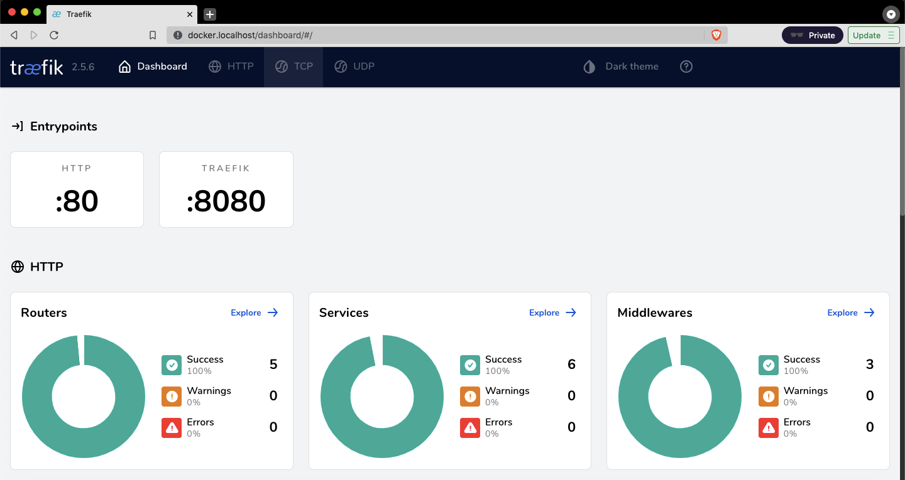

# DB - Application Server - Trafeik 
This project is Docker compose work that has three parts:

# DB
Postgresql database for persistence layer

# Application Server
Odoo application server as application layer

# Gateway
Trafeik as gateway to serve the services outside Docker.
The management screen is protected with Basic authentication.

Start all with
```
docker-compose up
```
Browse at http://docker.localhost/dashboard
User: user
Password: password


